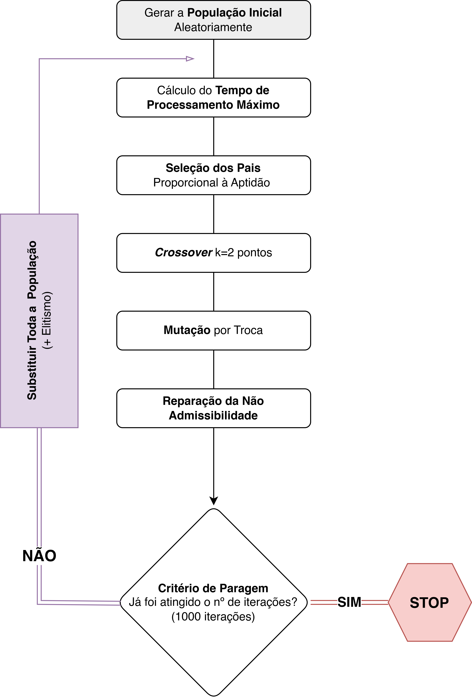

# ⚙️ Heuristic Optimization: From Linear Programming to Metaheuristics 🧠

<p align="center">
    <!-- Project Links -->
    <a href="https://github.com/Silvestre17/HeuristicOptimization_MultiObjective-TabuLists-GA"></a>
</p>

## 📝 Description

This repository is a portfolio of individual and group projects developed for the **Heuristic Optimization** course. It showcases the application of various optimization techniques, ranging from classical **Multi-Objective Linear Programming** to advanced **Metaheuristics** like **Tabu Search** and **Genetic Algorithms**. Each project tackles a unique, real-world problem, demonstrating the power of these methods in finding optimal or near-optimal solutions.

## ✨ Objective

The primary learning objectives demonstrated through these projects include:
*   Formulating and solving complex, multi-objective optimization problems.
*   Implementing sophisticated metaheuristic algorithms from scratch in Python.
*   Applying Goal Programming to handle conflicting objectives with different priorities.
*   Designing and implementing Genetic Algorithms, including chromosome representation and genetic operators.
*   Developing and applying the Tabu Search algorithm to escape local optima.

## 🎓 Project Context

This work was completed for the **Otimização Heurística** (*Heuristic Optimization*) course as part of the **[Licenciatura em Ciência de Dados](https://www.iscte-iul.pt/degree/code/0322/bachelor-degree-in-data-science)** (*Bachelor Degree in Data Science*) at **ISCTE-IUL**, during the 2022/2023 academic year (2nd semester of the 2nd year)

## 🛠️ Core Technology

All algorithms and solutions were implemented using the **Python** programming language.

<p align="center">
    <a href="https://www.python.org/">
        
    </a>
</p>

---

## 📚 Project Breakdown

This repository is divided into three core projects, each focusing on a different optimization paradigm.

### 🧁 [Individual Project I: Multi-Objective Production Planning](/OH_TrabalhoIndividual1_Multi-ObjectiveProductionPlanning/)

This project focused on finding an optimal production plan for a confectionery launching three new sweets. The challenge was to balance three conflicting objectives: maximizing long-term profit, maintaining the current workforce level, and limiting capital investment.

#### Key Concepts Implemented:
*   **Multi-Objective Linear Programming:** Formulated the problem with multiple, competing objective functions.
*   **Goal Programming:** Modeled the problem by defining hard constraints (which must be met) and soft constraints (goals to be achieved). Deviation variables (`d⁻`, `d⁺`) were used to measure underachievement or overachievement of these goals.
*   **Weighted-Sum and Minimax Methods:** Explored different approaches to combine the objectives into a single function to find a balanced solution.
*   **Preemptive Goal Programming:** Implemented a prioritized optimization approach, where objectives were satisfied sequentially based on their assigned priority level.

<p align="center">
    <a href="https://pulp.erik-nielsen.com/">
        
    </a>
</p>

---

### 🔬 [Individual Project II: Scientist Allocation with Tabu Search](/OH_TrabalhoIndividual2_TabuSearchScientistAllocation/)

This project tackled a combinatorial optimization problem: assigning ten senior scientists to ten distinct R&D projects at a pharmaceutical company, **Lusa_Med**, to maximize the total team aptitude.

#### Key Concepts Implemented:
*   **Metaheuristics:** Introduced the use of advanced search strategies to find high-quality solutions in a large search space.
*   **Tabu Search:** Implemented this powerful local search metaheuristic from scratch. The algorithm explores the solution space by iteratively moving to the best solution in the neighborhood of the current solution, even if it's worse than the current one, to escape local optima.
*   **Neighborhood Structure:** Defined a "neighbor" solution as one that can be reached by swapping the project assignments of two scientists.
*   **Tabu List:** The core of the algorithm, a short-term memory that stores recently made moves (swaps), forbidding them for a set number of iterations to prevent cycling and encourage diversification of the search.

---

### 🧬 [Group Project: Task Scheduling with a Genetic Algorithm](/OH_TrabalhoFinal_GeneticAlgorithm/)

This project focused on solving a complex task scheduling problem for a chemical plant, **Química_PT**. The goal was to assign ten independent tasks to three identical machines to minimize the makespan (i.e., the time required to complete all tasks).

#### Key Concepts Implemented:
*   **Genetic Algorithm (GA):** A population-based metaheuristic inspired by natural evolution, implemented from scratch.
*   **Chromosome Representation:** A solution was encoded as a **chromosome**, represented by a list of 10 genes, where each gene corresponds to a task. The order of genes defines the processing sequence.
*   **Fitness Function:** The "fitness" of each solution (chromosome) was calculated as the makespan, with the objective being to **minimize** this value.
*   **Genetic Operators:**
    *   **Selection:** Used **Proportional Selection (Roulette Wheel)**, where fitter individuals have a higher probability of being selected for reproduction.
    *   **Crossover:** Implemented a **k=2 points crossover** operator to combine genetic material from two parent chromosomes to create offspring.
    *   **Mutation:** Applied a **Swap Mutation** operator to introduce random changes and maintain genetic diversity.
*   **Elitism:** An elitism strategy was used to ensure that the best solution found in one generation is always carried over to the next, guaranteeing that the solution quality never degrades.
*   **Constraint Handling:** Developed procedures to repair "child" solutions that became inadmissible after crossover or mutation.

<p align="center">
    
</p>

## 🚀 How to Run the Code

Each project is contained in its respective folder and includes the Python script with the full implementation.

1.  **Prerequisites:** Ensure you have **Python 3.x** installed.
2.  **Install Libraries:**
    *   For the Multi-Objective project, install the `pulp` library:
        ```bash
        pip install pulp
        ```
    *   For other projects, only standard Python libraries are needed.
3.  **Execution:**
    *   Navigate to the desired project directory in your terminal.
    *   Run the Jupyter Notebook that contains the implementation:
        ```bash
        jupyter notebook <notebook_name>.ipynb
        ```


## 🇵🇹 Note

This project was developed using Portuguese from Portugal 🇵🇹.